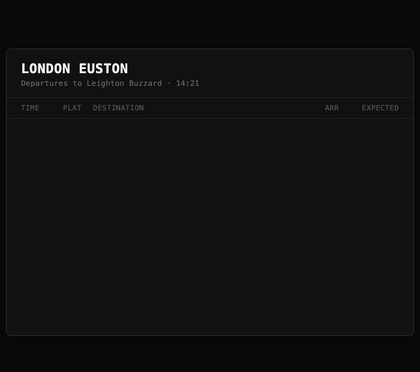

# /trains — A Claude Code Skill for UK Train Times

A [Claude Code](https://docs.anthropic.com/en/docs/claude-code) skill that checks live UK train departures, warns about disruptions, and adds trains to your Apple Calendar. Built on the free [Huxley2](https://github.com/jpsingleton/Huxley2) API (a JSON proxy for National Rail's Darwin system).



## What it does

- **Live departures** — shows the next trains between your two stations with platform, arrival time, and delay status
- **Disruption alerts** — checks for delays and cancellations on your route
- **Calendar integration** — adds a specific train to Apple Calendar via `.ics` export
- **Baseline timetable** — caches your route's schedule for offline reference
- **Smart direction** — auto-detects home→work (morning) or work→home (afternoon)

## Install

Copy the skill into your Claude Code skills directory:

```bash
cp -r . ~/.claude/skills/trains/
```

Or clone and symlink:

```bash
git clone https://github.com/maxtattonbrown/trains-skill.git
ln -s "$(pwd)/trains-skill" ~/.claude/skills/trains
```

## Setup

Run `/trains setup` in Claude Code. It will ask for your two station names, validate them against the National Rail API, and save the config to `~/.claude/trains/config.json`.

## Commands

| Command | What it does |
|---------|-------------|
| `/trains` | Next departures (direction based on time of day) |
| `/trains to work` | Force home→work direction |
| `/trains to home` | Force work→home direction |
| `/trains disruptions` | Check for delays/cancellations both directions |
| `/trains add 08:15` | Add the 08:15 departure to Apple Calendar |
| `/trains add next` | Add the next departure to Apple Calendar |
| `/trains timetable` | Show cached baseline schedule |
| `/trains refresh` | Re-capture baseline timetable |
| `/trains setup` | Reconfigure stations |

## How it works

The skill uses the [Huxley2 community instance](https://national-rail-api.davwheat.dev) — a free JSON REST proxy for National Rail's Darwin departure board API. No API key needed.

When you run `/trains`, Claude:
1. Reads your station config from `~/.claude/trains/config.json`
2. Fetches live departures via `curl`
3. Renders a departure board inline in the conversation

The board shows departure time, platform, arrival time, service type (fast/semi-fast/all stations), and delay status.

## Config

Stored at `~/.claude/trains/config.json`:

```json
{
  "home": {"name": "Leighton Buzzard", "crs": "LBZ"},
  "work": {"name": "London Euston", "crs": "EUS"}
}
```

Station names are validated against the API. CRS codes (3-letter station codes) are stored for reliable lookups.

## Standalone terminal use

The `scripts/departures.py` script also works standalone with ANSI-coloured output:

```bash
curl -s "https://national-rail-api.davwheat.dev/departures/EUS/to/LBZ?expand=true" \
  | python3 scripts/departures.py LBZ --theme board
```

Themes: `board` (amber departures board) or `clean` (minimal box-drawing). Add `--animate` for a split-flap effect.

## Requirements

- [Claude Code](https://docs.anthropic.com/en/docs/claude-code) (for the skill)
- Python 3 (for the display script)
- `curl` (for API calls)
- macOS (for Apple Calendar `.ics` integration — the core departures work anywhere)

## API

This skill uses the free [Huxley2 community instance](https://national-rail-api.davwheat.dev) which proxies National Rail's Darwin SOAP API as JSON REST. No registration or API key required. The Darwin data covers all GB rail operators.

Key limitation: the live API only sees ~4 hours ahead. The `/trains refresh` command captures a baseline timetable, but needs to be run at different times of day for full coverage.

## License

MIT
